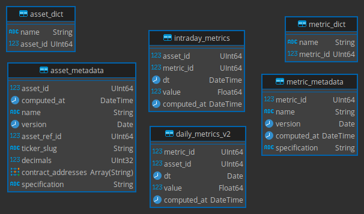
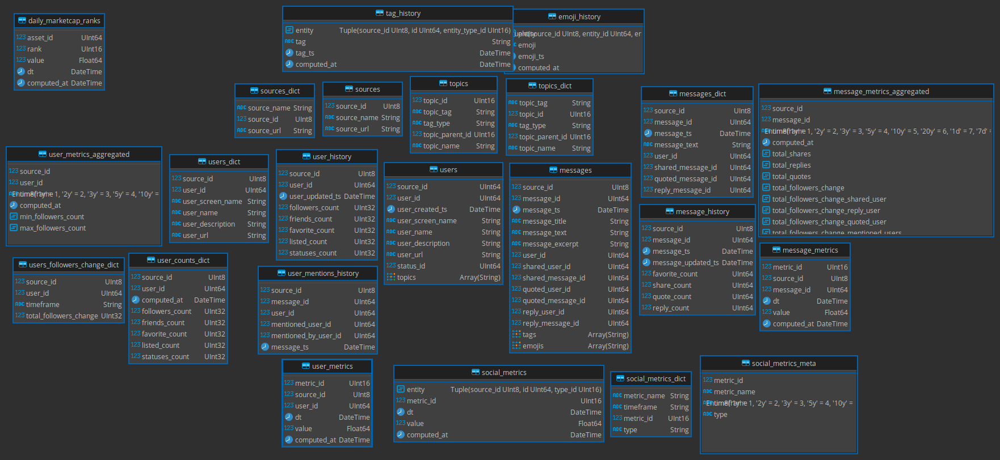

# Social Media Data Platform
fieldsets-local contains the systems architecture suggested to implement a singular data pipeline for social media metric ingestion. Currently the platform is utilizing 3 new repositories.

Currently this is a work in progress.

# Current Systems & Data Architecture

# Proposed Systems & Data Architecture

# Metrics
Twitter provides you raw counting totals for shares, replies and quotes of a given message. The aggregated metrics implemented within this framework allow you to view how messages are shared by users that are considered to be influential along with how those users influence is changing in realtime.

# Implemented Aggregate Social Metrics:
- Influencer Message Shares over a time window
- Influencer Message Replies over a time window
- Influencer Message Quotes over a time window
- Influencer Follower Percentage Change over a time window
- Influencer Post Frequency within a given window

# Remaining To-Do list:

## Data transformations
- Apply individual message scoring using the fieldsets-classification repository. The plan was to refactor this code to be utilized as a ClickHouse custom function which can be applied to messages using ClickHouse's native DDL.
- Lemmix data and remove neutral words
- Scan user messages for hash tags and mentions of assets and label users and messages. Keeping track of influencer project mentions along with message sentiment scores can provide an aggregate metric that represents an all encompassing outlook of all projects.
- Metrics hub integration with ClickHouse Custom User Defined Functions (UDFs).

# Data Ingestion
- Refactor Discord, Youtube, Telegram and Reddit Producers & Consumers to utilize Clickhouse instead of Elastic Search
- Refactor Bitcointalk consumer

## Aggregate Metrics
- Influencer Reach (total number of users that have seen messages including followers of followers) within a given window
- Utilizing the above aggregate metrics combined with the raw counting stats provided by the twitter API, create bins for observed values utilizing Scott's Rule to start. A summation of the values of these buckets can represent a simple influencer score.

# Future Metrics
It is unclear if the accuracy of this simple influencer metric will accurately predict social influence. We can iterate on out simple metric by training our model.